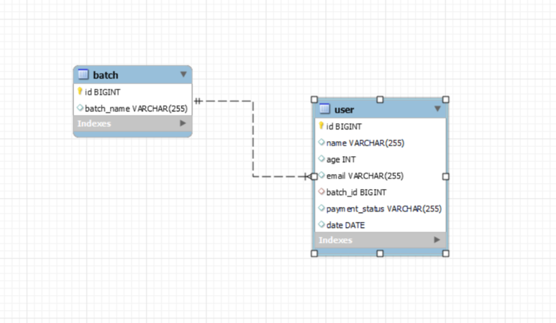

<h1 align="center"> 
  
</h1>
<b>Yoga web App</b>

This is Registration form of yoga class, this is dynamic webapp which react on real time data as well as it is a highly scalable application.This website is totally developed on tech stacks Java, Spring Boot for backend and reactjs for frontend. I have used ORM (Object Relationship Mapping) for database handling using hibernate framework (jdbc).Created Rest API.  

<b>Applications</b>

- spring-backend

Spring Boot Web Java backend application that exposes a REST API.
spring-backend stores its data in a MySql database.
Spring-backend has the following endpoints
Deployed Backed on railway.app API-https://backend-yoga-production.up.railway.app/user/all it showdata all user details.
To post data use this API-https://backend-yoga-production.up.railway.app/user/add (Use Postman)

- ReactJs-Frontend

ReactJS frontend application where users fill valid information.

<b>Prerequisites</b>

java 11+ 
MySQL

<b>ER Diagram</b>

</img>
